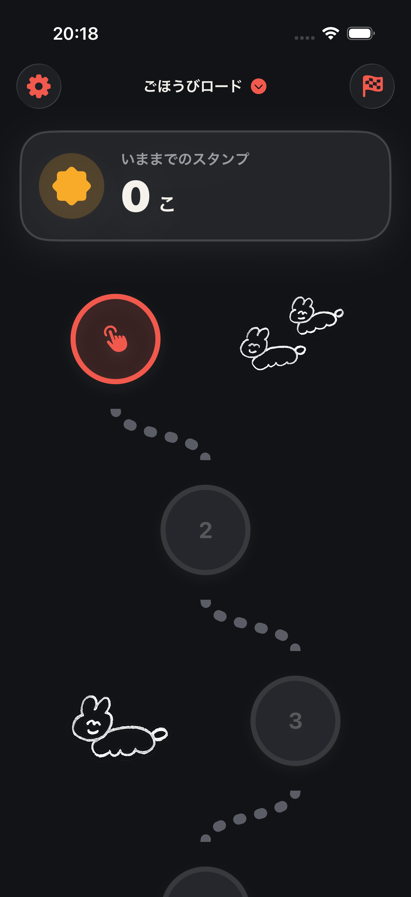
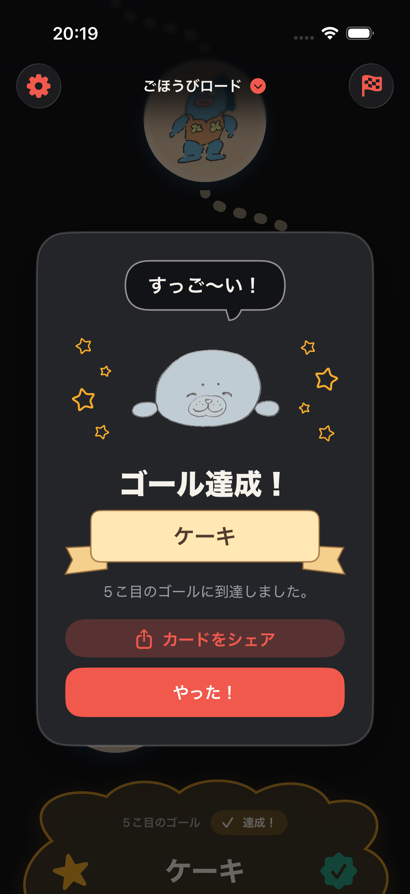
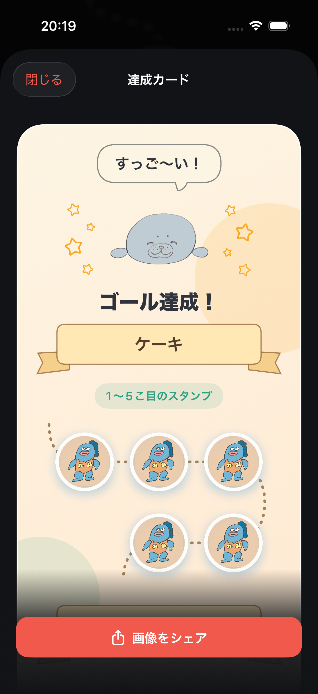
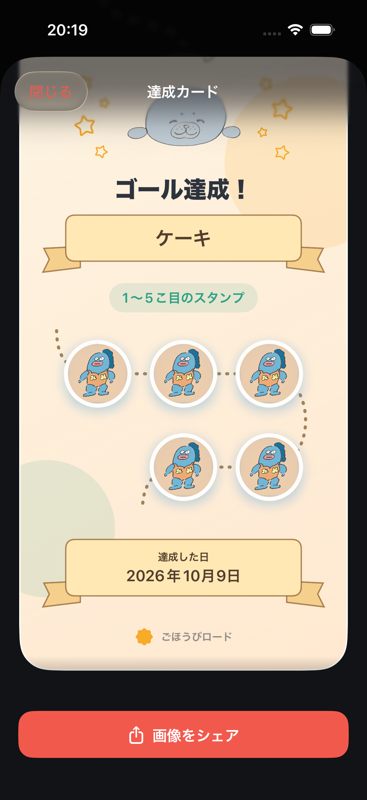
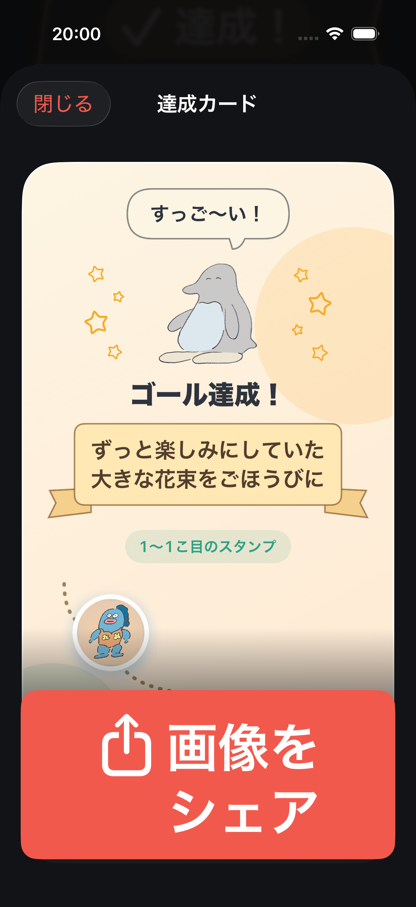

# ロードの仲間と達成カード — デザイン確認

2026年10月9日。iPhone 17 Pro / iOS 26.5 / Xcode 26.5で確認。

## 実装

- 添付の透過素材3種類をロードの曲がり角の空き側に配置。ロードIDと位置から素材・傾き・上下位置を選び、スクロールや再描画でも配置を維持する。
- 色付きのとろろ・ペンギンを達成画面と共有用の達成カードに表示。左右の装飾は、先端と内側の角を丸くした同じ星に統一。大小4個ずつ、合計8個をキャラクターの周りに配置。
- 「すっご〜い！」「お祝いしよう！」「ゆっくり休んでね！」「おめでとう！」をゴールのランダムなUUIDから選ぶ。同じゴールの達成画面とカードでは一致する。
- 元の透過PNGは変更せず保存。表示時に透明な余白を除いた範囲へ合わせ、表示用サムネイルをキャッシュする。

## 評価と修正

1. **ロード：良好。** スタンプの反対側にイラストを置き、タップ領域と道をふさがない。装飾はVoiceOverとヒットテストから除外。ダークモードでは線画の明るさを上げる。
2. **達成画面：修正後、良好。** 初回は吹き出しの先端が展開用の矢印に見えたため、一続きの輪郭に変更。ライトモードでは背後のロードが透けたため、不透明な背景を追加。高さ不足時にはスクロールできる。動きを減らす設定では紙吹雪を表示しない。
3. **達成カード：修正後、良好。** カードの影が個々の素材にも出ていたため、合成してから外側に影を付けるよう変更。プレビューと共有するPNGは同じ画像を使用。長いカードはスクロールで確認できる。

## 点線とリボンの追加レビュー

参照：IMG_9509.heic の蛇行する点線と達成日のリボン、IMG_9508.jpg のごほうび名のリボン。

1. **達成画面：良好。** ごほうび名を淡い金色のリボンに変更。文字と尾の領域を分離し、長文は中央部分の高さが伸びる。
2. **達成カード上部：修正後、良好。** スタンプを点線で順に結び、行の端で折り返す。2行目以降は道の進む向きに並べる。初回は道の入り口が孤立した1点に見えたため、左上から入るカーブに修正して再撮影。
3. **達成カード下部：良好。** 最後のスタンプの横から、入口の曲線を上下反転したような緩やかなカーブで日付リボンへ下る点線を追加。短い直角カーブと直線の組み合わせを、入口と同じ寸法の連続した二次曲線に修正。最終行の進行方向に合わせて左右を切り替える。スクロール後に日付全体とカード下端が見えることを確認。
4. **長い名前：良好。** 長いごほうび名がリボン内で2行に折り返され、文字と尾の重なりがないことを確認。最大文字サイズでも共有ボタンは操作可能。共有PNG自体は既存の固定サイズで描画される。

通常カード、日付部分、長い名前のプレビューを再撮影して評価。30件のユニットテストと2件のUIテストが成功。全端末サイズと実際のVoiceOver読み上げは未検証。

## 確認範囲

- ユニットテスト30件成功（共有PNG生成・サイズの既存テストを含む）。
- 達成→カード表示→閉じる→達成済みゴールから再表示のUIテスト成功。
- 長いごほうび名・アクセシビリティ最大文字サイズで共有操作のUIテスト成功。
- ライト／ダークの画面を目視確認。吹き出し・影・背景透けを修正して再撮影。
- VoiceOverの実際の読み上げ、全端末サイズ、実機のメモリ計測は未実施。

## 最終スクリーンショット

### 1. ロード

### 2. 達成画面

### 3. 達成カード

### 4. 達成日まで続く道

### 5. 長いごほうび名

